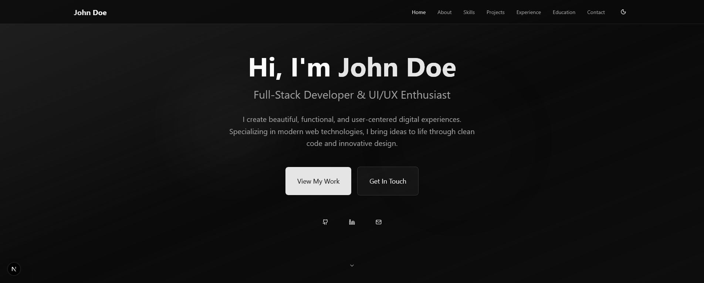
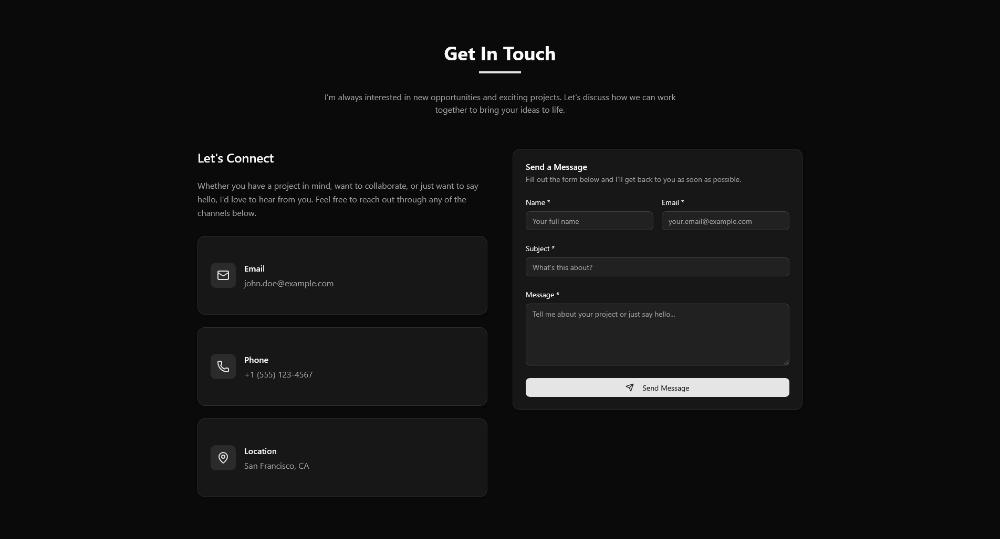
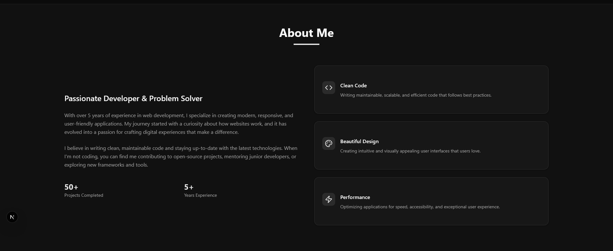
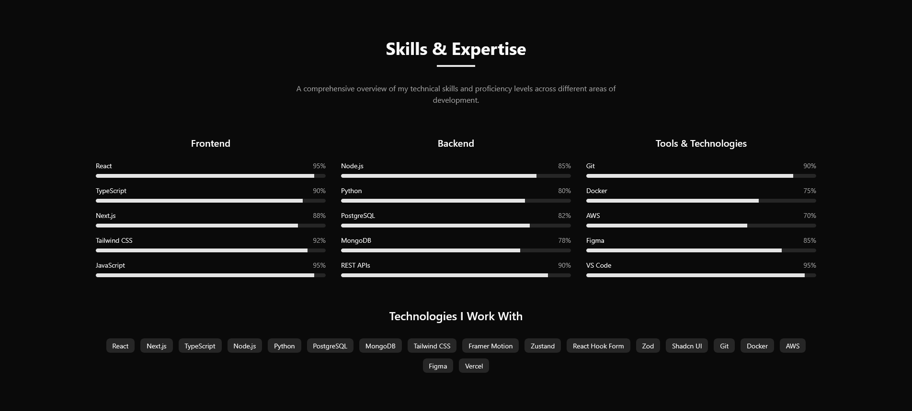
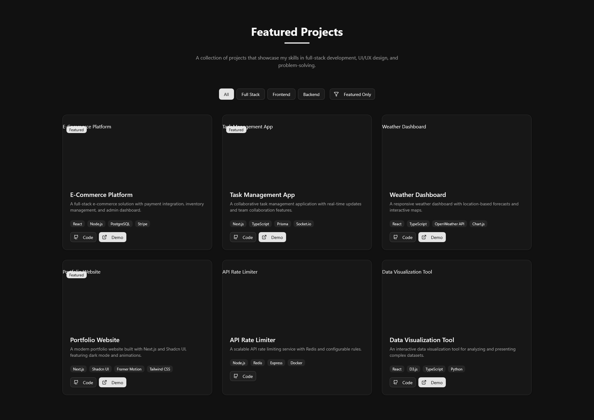
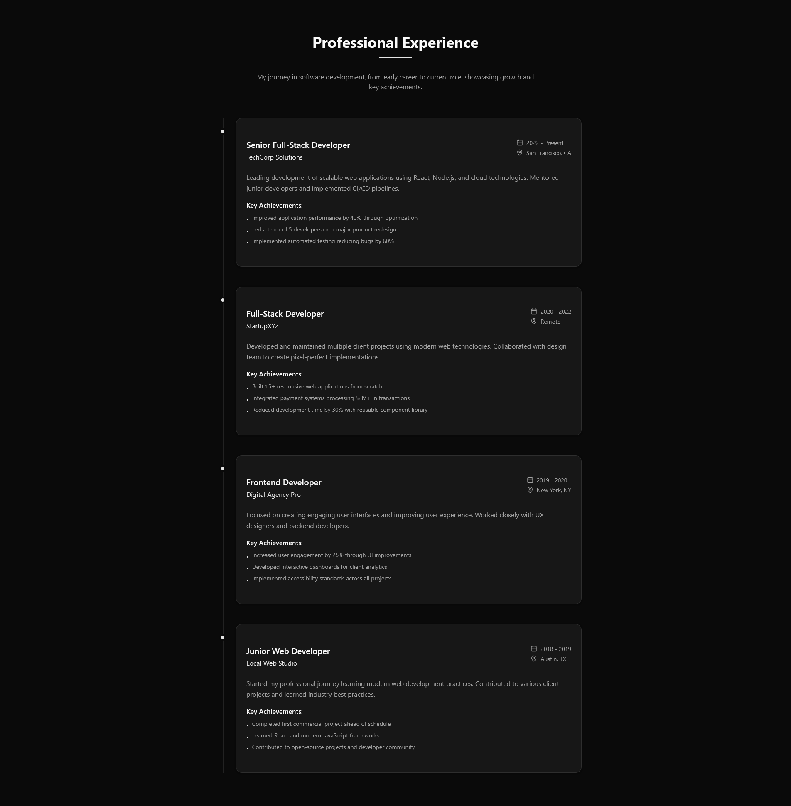
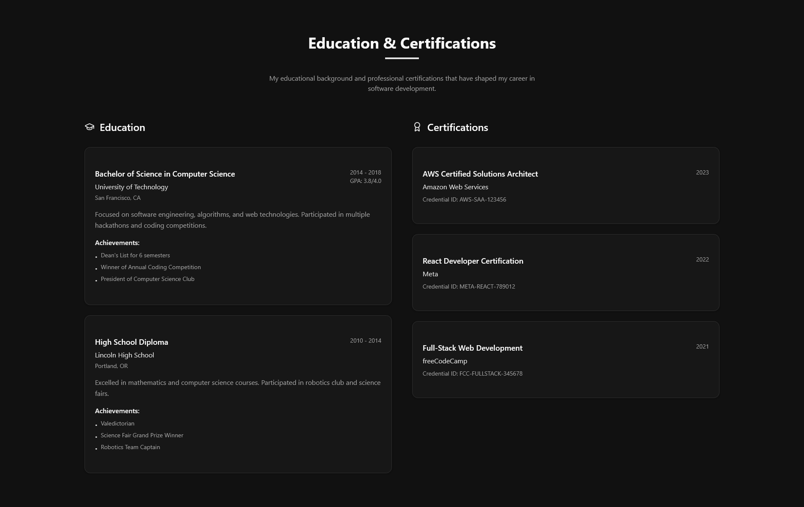

# Speck-It MCP Server

The Speck-It MCP Server adapts GitHub's Spec Kit workflow into a Model Context Protocol (MCP) service. It enables coding agents to generate specifications, implementation plans, task checklists, and execution playbooks directly within a project workspace. All generated artifacts are stored beneath the project's `.speck-it/` (or `.spec-kit/`) directory.

## Features

- **Spec generation** via `generate_spec` with constitution-aware summaries and clarifications.
- **Implementation planning** through `generate_plan`, producing phase-oriented guidance.
- **Enhanced task management** with `manage_project_tasks` supporting create, list, update, validate, get_next, get_status, and auto_update actions.
- **Execution tasks** with `generate_tasks`, `list_tasks`, `update_task`, `next_task`, and `complete_task` to track progress.
- **Advanced task tracking** using `ProjectTask` and `ProjectStatus` classes for comprehensive project oversight.
- **Governance hooks** including `set_constitution`, `get_constitution`, `feature_status`, and `finalize_feature`.
- **Root registration** utilities (`set_feature_root`) to ensure artifacts resolve to the correct project.
- **Centralized auto-updates** that automatically update task statuses across all workflow stages (constitution setting, feature root registration, spec generation, plan creation, and task generation).

## Quick Start

1. **Install dependencies**

   ```bash
   uv sync
   ```

2. **Run the MCP server**

   ```bash
   uv run python main.py
   ```

   The server communicates over stdio by default. Configure your MCP-compatible agent (e.g., Windsurf, Roo Code, Cline) to launch this command.

3. **Connect an agent**
   - Point the agent at the command above.
   - Supply `root` arguments or call `set_feature_root` if the agent executes outside the project tree.

## Example MCP Client Configuration

Below is a sample MCP configuration snippet that launches this server via `uv`:

```json
{
  "mcpServers": {
    "speck-it": {
      "command": "uv",
      "args": [
        "run",
        "--with",
        "mcp[cli]",
        "mcp",
        "run",
        "<path-to-repo>/main.py"
      ],
      "disabledTools": []
    }
  }
}
```

## Tooling Overview

- **Workspace setup**: `set_constitution`, `get_constitution`, `list_features`.
- **Specification pipeline**: `generate_spec`, `generate_plan`, `generate_tasks`.
- **Enhanced project management**: `manage_project_tasks` with comprehensive task operations (create, list, update, validate, get_next, get_status, auto_update).
- **Task execution**: `list_tasks`, `update_task`, `next_task`, `complete_task`, `feature_status`, `finalize_feature`.
- **Project binding**: `set_feature_root` to register the correct artifact root when auto-detection is insufficient.
- **Advanced tracking**: `ProjectTask` and `ProjectStatus` classes for detailed project oversight and milestone tracking.

## Storage Layout

Artifacts are written under `.speck-it/` by default:

```
.speck-it/
├── memory/
│   └── constitution.md
├── specs/
│   └── <feature-id>/
│       ├── spec.md
│       ├── plan.md
│       ├── tasks.md
│       └── analysis.json
└── state/
    └── <feature-id>_status.json
```

Set the `SPECKIT_STORAGE_DIR` environment variable to switch to an alternate directory name (e.g., `.spec-kit`).

## Enhanced Project Management

The Speck-It MCP Server now includes advanced project management capabilities that provide comprehensive task tracking and workflow automation:

### Centralized Task Management

The `manage_project_tasks` function provides a unified interface for all task operations:

- **Task Creation**: Create tasks with priorities, dependencies, prerequisites, and time estimates
- **Task Listing**: Filter and sort tasks by status, feature, type, or priority range
- **Task Updates**: Modify task status, add notes, update priorities, and track actual hours
- **Prerequisite Validation**: Ensure tasks meet all requirements before execution
- **Next Task Discovery**: Automatically identify ready-to-execute tasks across all features
- **Project Status Overview**: Comprehensive status reporting with feature breakdowns
- **Auto-Updates**: Automatically update task statuses based on workflow milestones

### Enhanced Task Classes

- **`ProjectTask`**: Advanced task representation with metadata, dependencies, and progress tracking
- **`ProjectStatus`**: Project-level status aggregation across all features and milestones

### Workflow Integration

All workflow stages now automatically update project tasks:

- Setting constitution → Marks global workflow tasks complete
- Registering feature root → Unlocks specification generation tasks
- Generating specifications → Transitions to planning phase
- Creating implementation plans → Unlocks development tasks
- Generating task lists → Enables execution phase

This ensures complete traceability and automatic workflow progression throughout the development lifecycle.

## Development

- Create a virtual environment or rely on `uv`'s managed environment (`uv venv`).
- Run formatting and tests before committing:
  ```bash
  uv run pytest
  ```
- Regenerate specs or plans when changing NLP heuristics in `lib/speckit.py` to keep templates up to date.

## Example Output: Next.js + TypeScript + shadcn/ui Portfolio

This repository includes a fully generated developer portfolio that showcases how the MCP server guides an agent from constitution setup through task completion. It was generated by running the MCP server against the shadcn/ui init project with "Grok Code Fast 1" in Windsurf. The screenshots reside in `screenshots/example-outputs/nextjs-dev-portfolio/`.

### Workflow Steps

- **Step 1 — Constitution**: `set_constitution` was used to enforce TypeScript, shadcn/ui, reusable patterns, strong typing, and Zustand for state needs. The system automatically updates project tasks to reflect this milestone.
- **Step 2 — Root Registration**: `set_feature_root` recorded the project directory so all artifacts write to the correct `.speck-it/` tree. Task statuses are automatically updated to unlock the next workflow stage.
- **Step 3 — Specification**: `generate_spec` captured the high-level goals for a SaaS-inspired portfolio with dark mode, animations, and rich sections filled with placeholders. The enhanced task management system automatically marks specification tasks as complete.
- **Step 4 — Planning**: `generate_plan` produced a detailed implementation roadmap aligning engineering tasks with the constitution. Project tasks are auto-updated to reflect planning completion and unlock implementation tasks.
- **Step 5 — Task Authoring**: `generate_tasks` converted the plan into a TDD-friendly checklist stored in `tasks.md`. The system uses `manage_project_tasks` to automatically transition from planning to execution phase.
- **Step 6 — Execution**: Each checklist item was implemented and closed via `update_task` and `complete_task`, with full traceability through the enhanced `ProjectTask` and `ProjectStatus` classes, producing the full Next.js + TypeScript + shadcn/ui experience.

### Screenshots

| Home                                                                 |
| -------------------------------------------------------------------- |
|  |

| Contact                                                                    | About                                                                  | Skills                                                                   |
| -------------------------------------------------------------------------- | ---------------------------------------------------------------------- | ------------------------------------------------------------------------ |
|  |  |  |

| Projects                                                                     | Experience                                                                       | Education                                                                      |
| ---------------------------------------------------------------------------- | -------------------------------------------------------------------------------- | ------------------------------------------------------------------------------ |
|  |  |  |

Additional sections (projects, experience, education, and contact) follow the same visual system and can be regenerated by re-running the workflow steps above.

## License

- Project code is provided under the **BSD 3-Clause License** (see `LICENSE`).
- Portions derived from GitHub's Spec Kit remain subject to the **MIT License**; the full text is reproduced in `LICENSE`.
